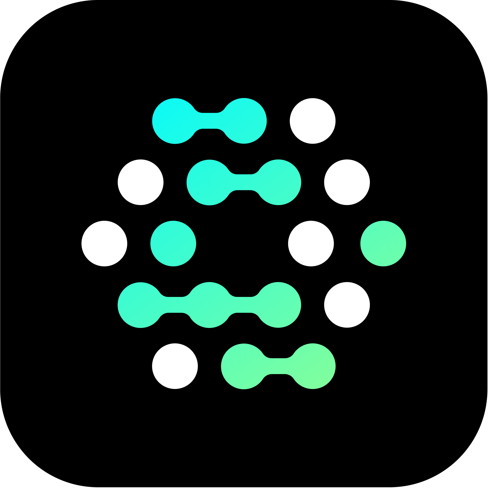

## OpenFGA Logos

This directory contains artwork in standard formats for OpenFGA. We prepare artwork in 2 formats (PNG & SVG), 3 layouts -- horizontal (also known as landscape format), stacked (which is closer to square), and icon (which does not include the name and is square). Inside each layout's directory, there are assets specifically prepared for light, dark, and sometimes black backgrounds.

With many browsers, you can right click and copy the logo of your choice below. Please note that although PNG is more common, SVG files sizes are smaller, supported in all common web browsers, and a high resolution format also suitable for high-resolution screens on web or print.

### OpenFGA Logos in PNG format

<table width="100%">
    <tr>
        <th></th>
        <th>for light backgrounds</th>
        <th>for dark backgrounds</th>
        <th>for black backgrounds</th>
    </tr>
    <tr>
        <td>Icon, color</td>
        <td></td>
         <td></td>
         <td>-</td>
    </tr>
    <tr>
        <td>Icon, monochrome</td>
        <td></td>
         <td></td>
        <td></td>
    </tr>
    <tr>
        <td>Horizontal, color</td>
        <td></td>
        <td></td>
        <td>-</td>
    </tr>
    <tr>
        <td>Horizontal, monochrome</td>
        <td></td>
        <td></td>
        <td></td>
    </tr>
    <tr>
        <td>Stacked, color</td>
        <td></td>
        <td></td>
        <td>-</td>
    </tr>
        <tr>
        <td>Stacked, monochrome</td>
        <td></td>
        <td></td>
        <td></td>
    </tr>
</table>

### OpenFGA Logos in SVG format

<table width="100%">
    <tr>
        <th></th>
        <th>for light backgrounds</th>
        <th>for dark backgrounds</th>
        <th>for black backgrounds</th>
    </tr>
    <tr>
        <td>Icon, color</td>
        <td></td>
         <td></td>
         <td>-</td>
    </tr>
    <tr>
        <td>Icon, monochrome</td>
        <td></td>
         <td></td>
        <td></td>
    </tr>
    <tr>
        <td>Horizontal, color</td>
        <td></td>
        <td></td>
        <td>-</td>
    </tr>
    <tr>
        <td>Horizontal, monochrome</td>
        <td></td>
        <td></td>
        <td></td>
    </tr>
    <tr>
        <td>Stacked, color</td>
        <td></td>
        <td></td>
        <td>-</td>
    </tr>
        <tr>
        <td>Stacked, monochrome</td>
        <td></td>
        <td></td>
        <td></td>
    </tr>
</table>
